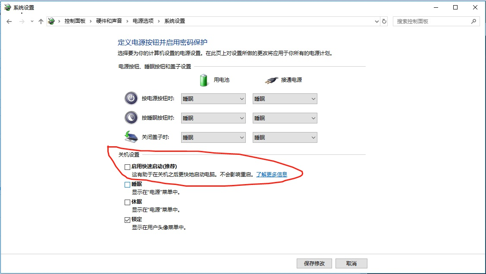
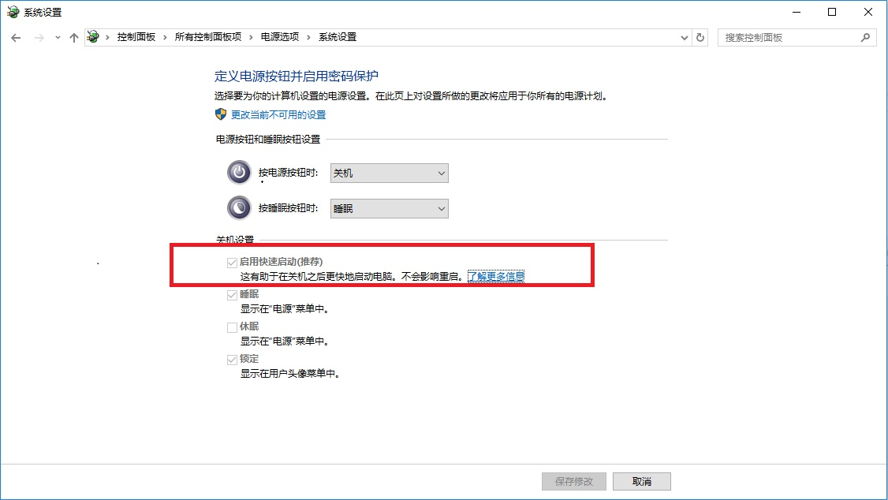

## example5

vs2017 调试 linux 代码时用的虚拟 linux 机


## 安装

1. 执行：

	```shell
	./setup.sh
	```


2. vs2017 内增加 该虚拟机

   > ip: 127.0.0.1<br>
   > port: 1022<br>
   > user: root<br>
   > password: root<br>

## 注意事项（1）

./setup.sh 示例中，开的虚拟 linux 机，没有 -v 挂 vcpkg 目录，也没有挂 vs2017 对应的 projects 目录。

若无故删除该 docker虚拟机 会导致 vcpkg install 的包丢失。

实际使用中，请自己做好挂接。这样做好处有二：

  - vcpkg包、projects目录可以直接 windows 下文件夹中管理。
  - vcpkg install 的包不会丢失，且可以 windows 调试、linux调试使用同一份 vcpkg。

如何挂接 vcpkg、projects 目录 属于 docker 知识，这里不再复述。（使用 -v 参数即可）


## 注意事项（2）

关于 win10 重启后，常驻容器无法正常提供工作。

请参考：https://github.com/docker/for-win/issues/1038#issuecomment-373231436

勾选取消掉下图中的功能：



若某些公司系统版本无法取消该功能的... 如图：



那么只能开机后，重启下 docker （还可能要重启下容器） ...
